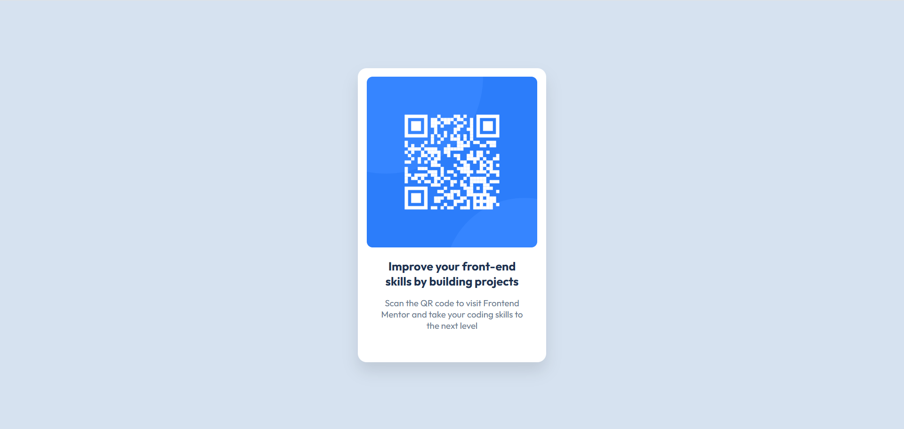

# Frontend Mentor - QR code component solution

This is a solution to the [QR code component challenge on Frontend Mentor](https://www.frontendmentor.io/challenges/qr-code-component-iux_sIO_H).

## Table of contents

- [Overview](#overview)
  - [Screenshot](#screenshot)
  - [Links](#links)
- [My process](#my-process)
  - [Built with](#built-with)
  - [What I learned](#what-i-learned)
  - [Continued development](#continued-development)
- [Author](#author)

## Overview

### Screenshot



### Links

- Solution URL: [the repository in github](https://github.com/Ekin-shieh/qr-code-component)
- Live Site URL: [Add live site URL here](https://your-live-site-url.com)

## My process

### Built with

- Semantic HTML5 markup
- CSS basic selectors
- Flexbox
- Responsive viewport meta tag
- Static asset management
- Project folder structure

### What I learned

This is my first attempt. It is very simple, but it gives me the opportunity to understand a lot of basic knowledge.
Only practice can really master them, only learning theory is not enough.

the layout of the web page:
```html
<div class="container">
  
  <h>Improve your front-end skills by building projects</h>
  <p>Scan the QR code to visit Frontend Mentor and take your coding skills to the next level</p>
</div>
```

how to render a web page:
```css
.container {
  width: 320px;
  height: 500px;
  justify-content: center;
  align-items: center;
  border-radius: 15px;
  box-shadow: 0 15px 25px rgba(0, 0, 0, 0.1);
  background-color: white;
  font-family: sans-serif;
  text-align: center;
  font-family: 'Outfit', sans-serif;
}

.container h{
  display: flex;
  padding: 0 30px;
  font-size: 20px;
  font-weight: 700;
  font-weight: bold;
  color: hsl(218, 44%, 22%);
}

.container p{
  display: flex;
  padding: 0 30px;
  font-size: 15px;
  font-weight: 400;
  color: hsl(216, 15%, 48%);
}
```

### Continued development

- Mastering the Grid system
- Try using Figma to restore complex design drafts
- Learn Git command operations and accumulate more projects

## Author

- Frontend Mentor - [@Ekin-shieh](https://www.frontendmentor.io/profile/ekin-shieh)
